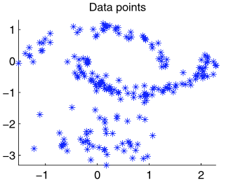
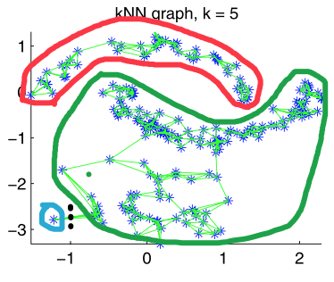

# 谱聚类

> 聚类方法是使用最为广泛的数据分析方法之一，可以被应用到各种不同的领域上。实际操作中，在处理各领域内的数据时，人们的第一反应是通过衡量样本间的相似度来对数据进行聚类。与传统方法相比，谱聚类方法具有许多突出的优点，聚类效果经常比传统方法好很多。

以上谱聚类的介绍来自参考资料[1]。

## 聚类与最小割问题

对于如下给定的样本数据

我们可以使用这些数据建出一个**相似度图**，其中

- 每个样本为图中的一个节点
- 每个样本与它的$k$个最近邻邻居相连
- 连边的权值为这两个样本的相似度（可用欧氏距离等）

建好图之后，对这些数据聚类可以看作是一个求这个图的**最小割**的过程：通过去掉这个图的一些连边，使这个图分成$$k$$个不连通的分量，并且去掉的连边的权值和最小。

但是，对于使用上述数据和方法构建的相似度图，最小割算法的结果可能会是这样的

显然，这种只把其中一个顶点分离开的结果达不到聚类的目的。因此，我们不仅要把图分成$$k$$个分量，还必须要求每个分量具有一个合理的大小。接下来我们会解决这一问题。

## 最小割问题及其扩展

**最小割问题**：对于一个图$$G=(V, E)$$，通过去掉这个图的一些连边，使这个图分成$$k$$个不连通的分量，并且去掉的连边的权值和最小。最小割问题可以定义为最小化如下目标函数

$$\min_{A_1, A_2, ..., A_k} \mathrm{cut}(A_1 , A_2 , ... , A_k)=\min_{A_1, A_2, ..., A_k} \frac{1}{2} \sum_{i=1}^{k} \mathrm{W}(A_i, \bar{A}_i)$$

其中

- $$A_i \subset V$$为图的第$$i$$个分量；
- $$\bar{A_i}$$为$$A_i$$的补集；
- $$\mathrm{W}(A_i, \bar{A_i})=\sum_{i \in A , j \in B} w_{ij}$$，表示两个分量之间的连接的权值的和；

---

为了使分割的每个分量具有合理的大小，在目标函数中引入图的大小相关项，扩展如下：

**RatioCut**：使用每个分量的顶点数量作为这个分量的大小，目标函数如下：

$$\min_{A_1, A_2, ..., A_k} \mathrm{RatioCut}(A_1, ..., A_k)=\min_{A_1, A_2, ..., A_k} \frac{1}{2}\sum_{i=1}^{k}\frac{\mathrm{W}(A_i, \bar{A_i})}{|A_i|}$$

**Ncut**：使用每个分量的容量作为这个分量的大小，目标函数如下：

$$\min_{A_1, A_2, ..., A_k} \mathrm{Ncut}(A_1, ..., A_k)=\min_{A_1, A_2, ..., A_k} \frac{1}{2}\sum_{i=1}^{k}\frac{\mathrm{W}(A_i, \bar{A_i})}{\mathrm{vol}(A_i)}$$

很遗憾，上面两个问题是NP-Hard的。我们会尝试近似求解上面两个问题

## 预备知识

**Graph Laplacian**

未归一化的Graph Laplacian矩阵$$L$$定义如下

$$L=D-W$$

其中$$D=diag(\{d_1, d_2, ... , d_n\})$$为图的度数矩阵，$$W$$为图的权值邻接矩阵.

Graph Laplacian矩阵具有如下性质

- 对于任意向量$$f \in \mathbb{R}^n$$

$$f'Lf=\frac{1}{2}\sum_{i,j=1}^{n}w_{ij}(f_i-f_j)^2$$

- $$L$$是一个对称矩阵，并且是半正定的。
- $$L$$最小的特征值为$$0$$，对应的特征向量为$$\vec{1}$$。
- $$L$$的所有特征值都为非负实数，$$0= \lambda_1 \le \lambda_2 \le \cdots \le \lambda_n$$。

**Reyleigh-Ritz定理**

见参考资料[2]

## RatioCut近似求解

先近似求解$$k=2$$的$$\mathrm{RatioCut}$$问题。

问题的目标函数如下：

$$\min_{A \subset V} \mathrm{RatioCut}(A, \bar{A})$$

对于一个子集$$A \subset V$$，定义向量$$f=(f_1, ..., f_n)' \in \mathbb{R}^n$$，这个向量的元素取值如下：

$$ f_i=\left\{
\begin{aligned}
\sqrt{|\bar{A}|/|A|},\quad & \mathrm{if} \quad  v_i \in A \\
-\sqrt{|A|/|\bar{A}|}, \quad & \mathrm{if} \quad  v_i \in \bar{A} 
\end{aligned}
\right.
$$

可以证明（推导见参考资料[1]）

$$f'Lf=|V| \cdot \mathrm{RatioCut}(A, \bar{A})$$

注意到

- $$\sum f_i = 0$$
- $$||f||^2=n$$

问题变成了

$$\min_{A \subset V} f'Lf, \quad \mathrm{s.t.} \quad f \perp \vec{1}, \quad ||f||=\sqrt{n}$$

这是一个离散优化问题，仍然是NP-Hard的。我们忽略离散约束，使$$f_i \in \mathbb{R}$$，问题转化为

$$\min_{f \in \mathbb{R}^n } f'Lf, \quad \mathrm{s.t.} \quad f \perp \vec{1}, \quad ||f||=\sqrt{n}$$

根据Rayleigh-Ritz定理我们可以直接得出，当$$f$$等于矩阵$$L$$的第二个特征值$$\lambda_2$$所对应的特征向量时，上述目标函数的取值最小。

求得$$f$$后，我们只需按照$$f_i$$的符号分配顶点$$v_i$$的类即可，即

$$ \left\{
\begin{aligned}
v_i \in A \quad & \mathrm{if} \quad  f_i \ge 0\\
v_i \in \bar{A} \quad & \mathrm{if} \quad  f_i < 0
\end{aligned}
\right.
$$

---

对于任意大小$$k$$的$$\mathrm{RatioCut}$$问题，定义$$H \in \mathbb{R}^{n \times k}$$，$$H=\{h_1, ..., h_k\}$$，其中$$h_j=(h_{1,j}, ..., h_{n, j})$$，其中

$$ h_{i,j}=\left\{
\begin{aligned}
1/\sqrt{|A_j|},\quad & \mathrm{if} \quad  v_i \in A_j \\
0, \quad & \mathrm{otherwise} 
\end{aligned}
\right.
$$

可以证明

- $$h_i'Lh_i={\mathrm{cut}(A_i, \bar{A_i})}/{|A_i|}$$
- $$h_i'Lh_i=(H'LH)_{ii}$$
- $$H'H=I$$

结合前面两条公式，得出

$$\mathrm{RatioCut}(A_1, ..., A_k)=\sum_{i=1}^{k} h_i'Lh_i=\sum_{i=1}^{k} (H'LH)_{ii}=\mathrm{Tr}(H'LH)$$

目标函数为

$$\min_{A_1, ..., A_k} \mathrm{Tr}(H'LH), \quad s.t. \quad H'H=I $$

忽略离散约束，目标函数变成

$$\min_{H \in \mathbb{R}^{n \times k}} \mathrm{Tr}(H'LH), \quad s.t. \quad H'H=I $$

根据Rayleigh-Ritz定理我们可以直接得出，当矩阵$$H$$的第$$j$$列为矩阵$$L$$的第$$j+1$$个特征值$$\lambda_{j+1}$$所对应的特征向量时，上述目标函数的取值最小。

求得矩阵$$H$$后，取矩阵$$H$$的第$$i$$行作为顶点$$v_i$$的embedding，再运行k-means算法聚类即可。

## 谱聚类算法流程

(1) 求图的Graph Laplacian矩阵$$L$$；

(2) 对矩阵$$L$$特征值分解，使$$L=U \Lambda U^\top$$，其中$$\Lambda=\mathrm{diag}(\lambda_1, ..., \lambda_n)$$，对角线上的元素为矩阵$$L$$的特征值，并且$$\lambda_1 \le \lambda_2 \le ... \le \lambda_n$$；

(3) 取矩阵$$L$$的前$$k$$个特征向量组成$$H \in \mathbb{R}^{n \times k}$$；

(4) 取矩阵$$H$$的第$$i$$行作为顶点$$v_i$$的embedding，运行k-means算法得到聚类结果。

## 讨论: Graph Laplacian矩阵的特征向量

通过上述问题可以看出，Graph Laplacian矩阵$$L$$的特征向量在区分顶点的类别上起重要作用，可作为顶点的embedding使用。所以可以看到这个矩阵和它的特征向量被广泛用在很多其它图学习的算法中。

## 来自sklearn文档的聚类算法对比图

详细请访问参考资料[3]

## 参考资料

[1] [A Tutorial on Spectral Clustering.](https://arxiv.org/abs/0711.0189)

[2] [Rayleigh Ratios and the Courant-Fischer Theorem.](http://www.cis.upenn.edu/~cis515/cis515-15-spectral-clust-appA.pdf)

[3] [Comparing different clustering algorithms on toy datasets.](http://scikit-learn.org/stable/auto_examples/cluster/plot_cluster_comparison.html#sphx-glr-auto-examples-cluster-plot-cluster-comparison-py)
